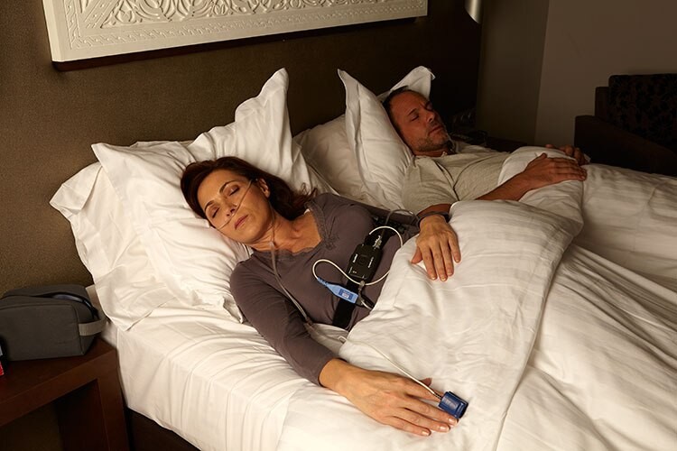

## لماذا قد تحتاج إلى دراسة النوم؟

إذا كنت تعاني من أيٍّ من الأعراض التالية، فقد تكون معرّضاً لخطر **انقطاع التنفس الانسدادي أثناء النوم (OSA)** — وهي حالة يمكن أن تؤثر على صحة القلب والأوعية الدموية، واستقرار التنفس، وجودة الحياة بشكل عام:

- شخير مرتفع
- صداع صباحي
- نعاس مفرط أثناء النهار
- توقف ملحوظ في التنفس أثناء النوم

---

## ما هي دراسة النوم المنزلية؟

دراسة النوم المنزلية — المعروفة أيضاً باسم **اختبار النوم خارج المركز** — تُجرى في راحة منزلك. يُسجّل جهاز مراقبة صغير ومتقدم المعايير الفسيولوجية الأساسية أثناء نومك.

صُمّم هذا الاختبار خصيصاً للكشف عن:

- توقف التنفس المتكرر
- انخفاض مستويات الأكسجين في الدم
- أنماط التنفس غير الطبيعية أثناء الليل

---

## ماذا تقيس دراسة النوم المنزلية؟

تُسجّل أجهزتنا المتقدمة مجموعة شاملة من المعايير الفسيولوجية، تشمل:

### 1. معايير التنفس
- جهد التنفس (حزام الصدر)
- تدفق الهواء عبر الأنف
- كشف الشخير

### 2. الأكسجة
- تشبع الأكسجين (SpO₂)
- مؤشر نقص تشبع الأكسجين (ODI)
- مدة وشدة أحداث نقص التشبع

### 3. معايير القلب
- معدل ضربات القلب
- تغيّر النبض

### 4. وضعية الجسم
- مدة النوم حسب الوضعية
- توزيع الأحداث حسب الوضعية
- تحليل الاعتمادية الوضعية

### 5. تحليل شامل لأحداث التنفس
- AHI (مؤشر انقطاع التنفس-نقص التنفس)
- RDI (مؤشر اضطراب التنفس)
- AI (مؤشر انقطاع التنفس)
- HI (مؤشر نقص التنفس)
- عدد أحداث OSA / CSA / MSA
- أحداث RERA
- إجمالي مدة الأحداث وتكرارها
- تقييم استقرار التهوية

---

## كيف تُفسَّر النتائج؟

بعد اكتمال الاختبار، تتم مراجعة جميع البيانات وتفسيرها بواسطة **أخصائي نوم مؤهّل**. يتضمن التقرير السريري النهائي:

- **تصنيف الشدة** — طبيعي، خفيف، متوسط، أو شديد
- **النمط التنفسي** — انسدادي، مركزي، مختلط، أو وضعي
- **تقييم استقرار الأكسجة**
- **تحليل الاستجابة القلبية الوعائية**
- **تقييم المخاطر السريرية**
- **توصيات علاجية مبنية على الأدلة**

> يُصدر التقرير الكامل عادةً خلال **48 ساعة عمل**.

---

## كيف تعمل الخدمة؟

إذا وصف لك طبيبك دراسة نوم منزلية، فإن العملية تسير كالتالي:

1. **احصل على وصفة طبية** من طبيبك.
2. **تواصل معنا** لتحديد موعد.
3. **تركيب الجهاز** — يزور فنّي مدرّب منزلك لتركيب الجهاز وتقديم التعليمات.
4. **نَم كعادتك** — يُنصح بتسجيل 6 ساعات على الأقل.
5. **أعِد الجهاز** في اليوم التالي.
6. **استلم تقريرك** وراجع النتائج مع طبيبك.

---

## لماذا تختار خدمة دراسة النوم المنزلية لدينا؟

- لا حاجة لزيارة المستشفى أو مختبر النوم
- راحة قصوى في منزلك
- مواعيد مرنة
- تكلفة أقل مقارنة بالاختبار داخل المختبر
- نتائج سريعة ودقيقة

---

## تعليمات مهمة قبل اختبار النوم

### خلال النهار
- تجنّب القيلولة أثناء النهار
- تجنّب القهوة والشاي المركّز ومشروبات الطاقة والتدخين بعد الظهر
- مارس نشاطاً خفيفاً فقط؛ تجنّب التمارين المكثفة

### قبل النوم
- تناول عشاءً خفيفاً قبل 2-3 ساعات من النوم
- خذ دشاً دافئاً لاسترخاء الجسم
- ارتدِ ملابس قطنية مريحة

### عند النوم
- حافظ على غرفة مظلمة وهادئة
- حافظ على درجة حرارة مريحة في الغرفة
- تجنّب استخدام الهاتف والتلفزيون قبل النوم
- مارس التنفس العميق والاسترخاء اللطيف
- لا تقلق بشأن الجهاز أو الأسلاك — ستتأقلم بسرعة

### ملاحظات إضافية
- اذهب إلى الفراش في وقتك المعتاد
- إذا استيقظت أثناء الليل، استرخِ وحاول العودة إلى النوم
- يلزم **6 ساعات من النوم على الأقل** للحصول على نتائج دقيقة